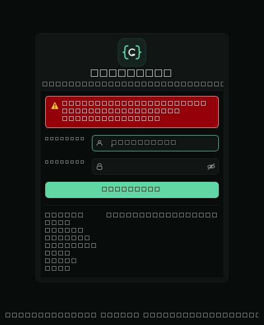
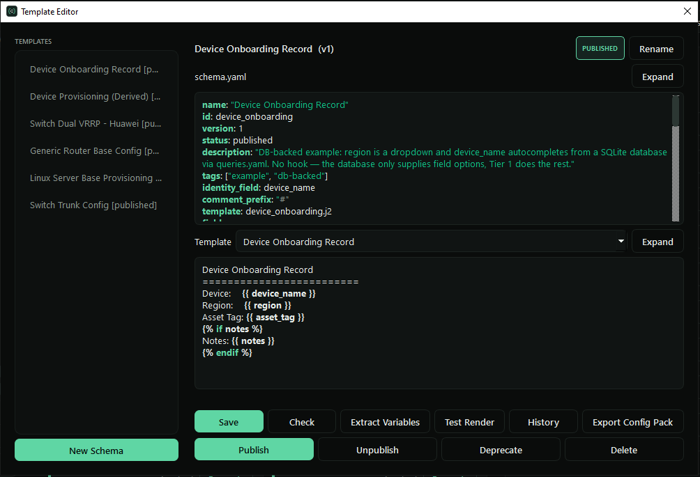
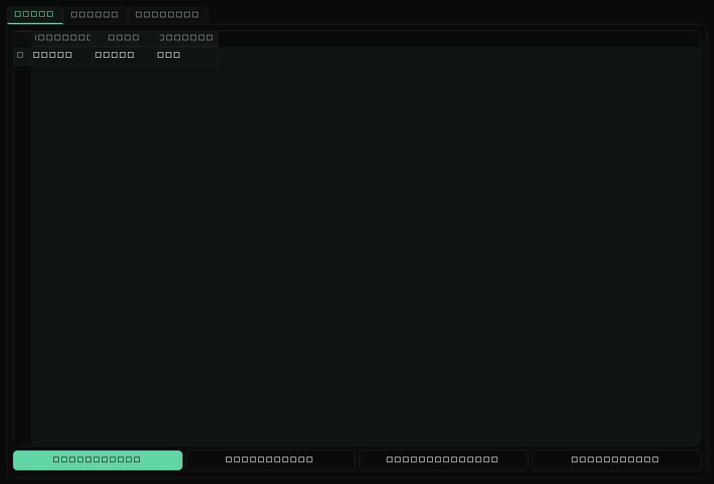

# ConfigGen

[](LICENSE)
[](pyproject.toml)

A generic, plug-and-play desktop tool (GUI + CLI) for generating text
configurations from a guided form and Jinja2 templates. It grew out of
network configs (router/switch configs are the running example throughout
the docs), but there's nothing network-specific in the engine — anyone can
add a config by dropping in a schema file, a template, and (optionally) a
small Python hook. No changes to the core.








Config Engineers fill in a form and get a validated, rendered config with
one click. Template Engineers write the schema + Jinja template that
*defines* that form. Admins manage users, groups, and template lifecycle —
see [docs/roles-and-groups.md](docs/roles-and-groups.md) for the full
picture. Or just run it solo, alone, with nobody else's roles or groups to
think about.

## Quick start (from source)

```bash
git clone https://github.com/ConfigGen/ConfigGen.git
cd ConfigGen
pip install -e ".[gui]"   # add the desktop GUI (PySide6/Qt)
configgen-gui              # first run bootstraps admin/admin - change it
```

CLI only, no GUI (e.g. for CI or a server)? Skip the `gui` extra:

```bash
pip install -e .
configgen list --dir examples/schemas
```

The example configs under `examples/` are self-contained (own schemas,
templates, sample database, sample CSV) — try one immediately:

```bash
configgen check examples/schemas/router_base_config.yaml
configgen generate examples/schemas/router_base_config.yaml \
  --values examples/sample_router_values.json --output /tmp/out
```

## Install

- Python 3.10+
- `pip install -e ".[gui]"` for the desktop app, `pip install -e .` for
  CLI-only
- Windows exe: see [Building the Windows exe](#building-the-windows-exe)
  below
- Docker (CLI-only, no Qt): see [Docker](#docker) below

## Building the Windows exe

```powershell
git clone https://github.com/ConfigGen/ConfigGen.git
cd ConfigGen
python -m venv .venv
.venv\Scripts\pip install -e ".[dev]"
.\packaging\build.ps1
```

[packaging/build.ps1](packaging/build.ps1) wraps
[packaging/ConfigGen.spec](packaging/ConfigGen.spec) end to end: it
installs PyInstaller into the venv if it's missing, regenerates
`packaging/icon.ico` from `resources/branding/logo.svg`, runs PyInstaller
(a one-folder build, not `--onefile` — faster startup, easier to inspect
what actually shipped), and copies starter `resources/schemas`,
`resources/templates`, and `resources/data` next to the built exe (that
content is written to at runtime by the Template Editor, so it can't live
inside PyInstaller's own bundle — see `paths.py`). The result lands at
`dist\ConfigGen\ConfigGen.exe`; keep the whole `dist\ConfigGen\` folder
together when you move or zip it up — the exe depends on its sibling
`_internal\` folder.

Useful flags:

```powershell
.\packaging\build.ps1 -Clean                             # wipe build/ and dist/ first, from scratch
.\packaging\build.ps1 -Python C:\Python312\python.exe     # build with a specific interpreter
.\packaging\build.ps1 -Sign                               # build, then run sign.ps1 on the result
```

The exe is unsigned by default. See [packaging/sign.ps1](packaging/sign.ps1)
for self-signing — read its notes first: a self-signed exe still shows an
"unknown publisher" warning on any machine that hasn't explicitly trusted
the certificate ([packaging/deploy-cert.ps1](packaging/deploy-cert.ps1));
only a paid EV certificate clears that everywhere automatically. For a
public, open-source tool, "just run from source" is the honest
zero-friction path.

## Docker

[packaging/Dockerfile](packaging/Dockerfile) builds a CLI-only image — no
GUI, no PySide6/Qt — for running ConfigGen as a local service or in CI:

```bash
docker build -t configgen:latest -f packaging/Dockerfile .
docker run --rm -v ./my-configs:/app/resources configgen:latest list
docker run --rm -v ./my-configs:/app/resources configgen:latest \
  generate widget --values values.json --api-key <key>
```

Mount your own project directory over `/app/resources` — the image ships
no schemas of its own, and `pip install .` (not `.[gui]`) is used at build
time so PySide6/Qt is never pulled in, keeping the image small. Config
packs, `users.db`, and generated output all live under that same mounted
directory, so state persists across container runs as long as you reuse
the same host path.

## Adding a config (the four-line pitch)

```bash
# 1. Write resources/schemas/my_thing.yaml   (fields + template name)
# 2. Write resources/templates/my_thing.j2   (the Jinja2 output)
# 3. Optional: resources/hooks/my_thing.py   (a build() hook for derived/DB-backed values)
configgen check resources/schemas/my_thing.yaml   # validates + warns on template/field mismatches
```

That's it — no core code changes, no restart of anything else. The GUI
picks it up as a new dashboard tile the next time it lists schemas. See
[docs/adding-a-config.md](docs/adding-a-config.md) for a full worked
example (form-only → multi-document → database-backed), including the
"write the template first" workflow via `configgen extract --scaffold`.

## Documentation

| Doc | What's in it |
|---|---|
| [docs/adding-a-config.md](docs/adding-a-config.md) | Worked examples: form-only, multi-document, DB-backed |
| [docs/schema-reference.md](docs/schema-reference.md) | Every field type, every schema option |
| [docs/hooks.md](docs/hooks.md) | The `build()` hook contract, `services.db`/`services.net`, custom filters |
| [docs/bulk-generation.md](docs/bulk-generation.md) | CSV/database-driven batch generation |
| [docs/roles-and-groups.md](docs/roles-and-groups.md) | The three-role model, group scoping, template lifecycle |
| [docs/troubleshooting.md](docs/troubleshooting.md) | The errors you'll actually hit, and what they mean |

## Development

```bash
pip install -e ".[dev]"   # dev extra includes the gui extra + test/lint tooling
pytest
ruff check .
black --check .
```

Screenshots above are real renders, not mockups — regenerate them after a
UI change with `python tools/screenshot.py` (uses Qt's offscreen platform,
no display needed).

## License

MIT — see [LICENSE](LICENSE).
